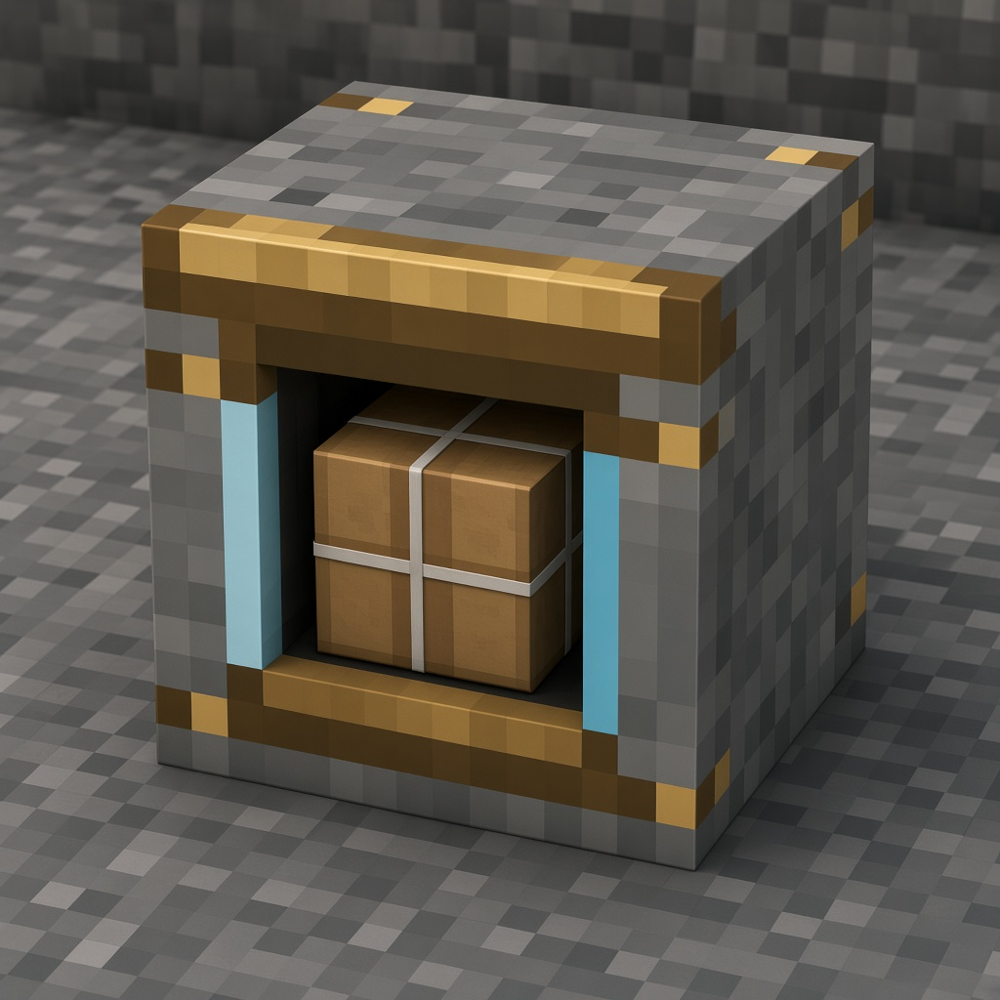

# 机械动力：远仓

跨服仓管，不合并物流网。

[中文](README.md) · [English](README.en.md)

[](https://github.com/EVGA2048/Create-Distant-Stock/releases)
[](LICENSE)
[](https://adoptium.net/)
[](https://neoforged.net/)
[](https://modrinth.com/mod/create)

<p align="center">
  
</p>

**Create: Distant Stock** 是面向 NeoForge 1.21.1、依赖 Create 6 的跨服仓管附属。各服各装一份。仓库服听口，外服连仓库：一座仓库，多台生存服。玩家只调谐频率、填写包裹地址，**方块里不填 IP**。

安山岩承重，黄铜做机构，霁青以太只出现在接口、导轨和指示上。港接在打包机、皮带和漏斗后面，不另做远端打包机。

模组 id：`distantstock`。当前版本以 [`gradle.properties`](gradle.properties) 与 [Releases](https://github.com/EVGA2048/Create-Distant-Stock/releases) 为准。HTTP 默认 **18772**，头 `X-DistantStock-Token`。代码只认配置里的 `self.id`，不要写死服名。

## 设备

| 远仓港 | 远仓请求台 | 远仓监视器 | 便携请求器 |
|:---:|:---:|:---:|:---:|
|  |  |  |  |
| 出货 / 收货停泊舱 | 落地仓管台 | 贴墙链路仪表 | 加入网络并下单 |

上图为工坊效果图，用来说明材料和轮廓。进游戏后按住 **W** 打开思索，可看产线摆法。

| 中文 | id | 作用 |
|------|-----|------|
| 便携式远仓请求器 | `requester` | 手持或 Curios `body`；从开放网络加入；**H** 打开 |
| 远仓港 | `dock` | 出货抄频率寄未拆包裹；收货只认地址 |
| 远仓请求台 | `gauge` | 落地仓管台，和便携同一套界面 |
| 远仓监视器 | `monitor` | 贴墙看本端 / 对端 TPS 与链路压力 |
| 远仓说明书 | `manual` | 创造栏；`giveManual` 默认开，进档送一本 |

三块方块都接 Create 工程师护目镜。护目镜只报活数据，教程在说明书和思索里。**永远不显示**主机、端口或 token。

## 它做什么，不做什么

Create 的物流网只在**本 JVM** 里算。远仓只把未拆封的 `PackageItem` 连同地址 hop 到对面。

- 没有第三台中心服。仓库听口，外服只连仓库。
- 客户端零 HTTP。本服 io 线程去拉对面，结果进缓存。
- 不合并两张 Stock Link，不拆散件再寄。
- 不是无人机系统，也不做远端打包机。仓库服用原版打包机。
- 主线程禁止 HTTP，也不为等回包卡住。入队后下一 tick 再打包或还原。

```
玩家 → 本服菜单 / 方块
         ↓ 主线程：入队、扫仓、打包裹
本服缓存 ← io 线程 HTTP → 对端 18772
```

## 怎么接到产线上

舱口朝操作者，侧面或背面留给物流。漏斗、皮带可以贴任意面。

1. **仓库出货**：库存 → 打包机 → 皮带或漏斗 → 出货港。
2. **外服收货**：收货港 → 漏斗 → 皮带 → 容器；要拆包再用打包机。
3. 请求台放在产线旁边，监视器贴墙，都不占包裹路径。
4. 港要保持区块加载。舱里出现纸箱 = 槽里有货；霁青导轨亮 = 链路在线。

对着远仓物品按住 **W**，思索里有出货、收货、调谐和排障四段。思索只演示，不连真实仓库。

## 安装

每一台互通的服务器都需要 **Java 21**、**NeoForge 1.21.1**、**Create 6.0.6–6.0.10**（以 6.0.10 验证）。Curios 可选。两边要能访问 **18772**。

1. 把 `Create-Distant-Stock-<版本>+mc1.21.1.jar` 放进两边的 `mods/`，与 Create 一起启动一次。
2. OP 输入 `/distantstock`，或潜行右键监视器：
   - **Host 仓库**：本端 ID、监听 `0.0.0.0:18772`、外服 `id@主机:端口`、密码。
   - **Client 外服**：不重复的本端 ID、同样开监听、仓库 `host@主机:端口`、**同一密码**。
3. 正式服密码用随机长串。空 token 仅开发用。

## 玩家怎么用

1. 仓库服放置并启用未锁定的 **Stock Link**。
2. 任意已连接服务器打开请求器，从开放网络加入，不必亲自去仓库。
3. 搜索、加入购物车、填包裹地址、下单。
4. 已调谐请求器右键港 = 出货；潜行右键 = 收货（空地址为 `*`）。
5. 空手右键请求台打开同一套仓管界面；右键监视器看链路。

`debug.demoStock` 只在开发时开。对着演示列表下单不会从仓库扣东西。

## 配置

`config/distantstock-common.toml`：

| 键 | 含义 |
|---|---|
| `self.id` | 仓库用 `host`，外服各自不重复 |
| `self.bind` | 监听，默认 `0.0.0.0:18772` |
| `peers` | `id@host:port`。仓库填外服，外服只填仓库 |
| `peer.host` / `peer.port` | 旧单项对端；`peers` 为空时当作 `id=peer` |
| `token` | 两边相同；空 = 不校验 |
| `giveManual` | 进档送说明书，默认 `true` |
| `debug.demoStock` | 空缓存显示假目录，正式服用 `false` |

## HTTP

仅本服 io 线程访问。token 非空时需要 `X-DistantStock-Token`。

| 方法 | 路径 | 作用 |
|------|------|------|
| `GET` | `/stock?freq=` | 只读库存缓存 |
| `GET` | `/status` | TPS、MSPT、队列、`self.id` |
| `POST` | `/order` | 入队订单；`from` 决定包裹寄回哪一台 |
| `POST` | `/package` | 入队包裹 NBT，主线程按地址还原 |

队列满返回 `503`，对端重试。

## 注意

1. 两边 `token` 必须相同，正式服不要留空。
2. `peer.host` 必须是对端能访问的地址，不要对另一台机器写 `127.0.0.1`。
3. 外服不会复制 Stock Link。跨服只认未拆包裹。
4. 只下单、没有出货港吃箱，对面收不到货。
5. 收货地址要对得上；下单成功只表示已入队。
6. 不要把 token 和主机写进公开仓库或截图。

## 构建

JDK 21。编译期 `compileOnly` 本地 Create jar，运行时由游戏加载 Create。

```bash
./gradlew jar
# → build/Create-Distant-Stock-<版本>+mc1.21.1.jar
```

只部署当前这一份，不要和旧 jar 叠放。

## 许可证

[MIT License](LICENSE)。

便携请求器的物品模型布局改编自 [Create: Mobile Packages](https://github.com/tom5454/Create-Mobile-Packages)（MIT，Tim Heidler）。Create 仓管界面贴图运行时读取 `create` 命名空间，不打进本 jar。

缺陷请开 [Issue](https://github.com/EVGA2048/Create-Distant-Stock/issues)。本模组仍在测试，建议只用于互相信任、能共同维护端口与 token 的一组服务器。
