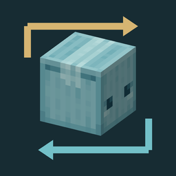
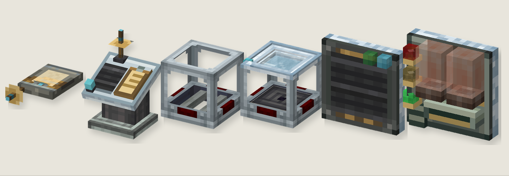
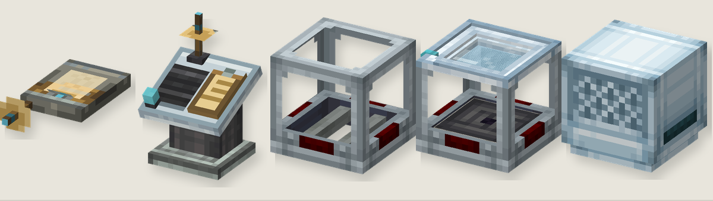
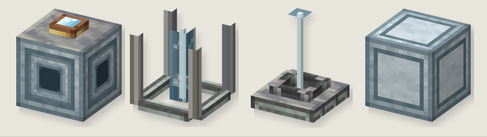
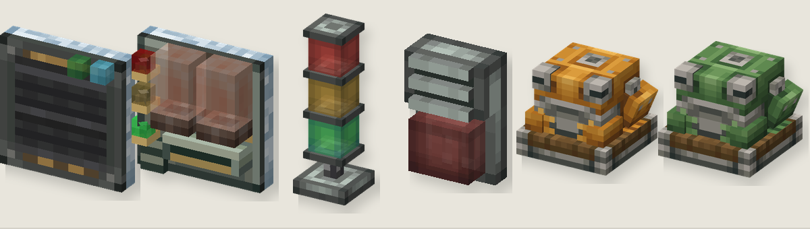

<p align="center">
  
</p>

<h1 align="center">Create: Distant Stock · 机械动力：远仓</h1>
<p align="center">把 Create 仓库、工厂与包裹物流连接到另一台 Minecraft 服务器。</p>

<p align="center">
  <a href="README.en.md">English</a> ·
  <a href="https://github.com/EVGA2048/Create-Distant-Stock/releases">下载</a> ·
  <a href="docs/wiki/README.md">玩法 Wiki</a> ·
  <a href="https://github.com/EVGA2048/Create-Distant-Stock/issues">Issues</a>
</p>

<p align="center">
  
  
  
  <a href="LICENSE"></a>
</p>

> [!IMPORTANT]
> **本模组仍处于开发与多人测试阶段。** 功能、配方、平衡、网络协议与存档数据仍可能调整，重要存档升级前请做好备份。欢迎加入项目交流群参与测试和讨论；如果遇到可以稳定复现的问题，请在 [Issues](https://github.com/EVGA2048/Create-Distant-Stock/issues) 提交日志与复现步骤。



**Create: Distant Stock（机械动力：远仓）** 是围绕 Create 仓储物流扩展的一套跨服务器仓储、订单与包裹运输系统。

它不是把多台服务器的库存直接合并成一个“无限距离箱子”。每座仓库仍然是一张独立的 Create 物流网络：来源仓库要真实接单和打包，包裹要经过远仓港交给 Transerver，抵达目标服务器后再进入当地的 Create 皮带、锁链、蛙港和分拣系统。

```text
来源 Create 仓库
    ↓
远仓请求 / 自动补货
    ↓
远仓打包机 → 远仓港
    ↓
──────────── Transerver ────────────
    ↓
目标远仓港 → 本地 Create 包裹物流
```

这套设计适合中央仓库、独立生产服、生存服与大型多人工业区：跨服层负责“把包裹送到另一台服务器”，Create 继续负责“这个包裹在本地怎么生产、怎么打包、怎么分拣”。

## 主要功能

- **跨服库存浏览与下单**：从便携终端或固定请求台选择远方成员仓库并提交订单。
- **真实 Create 包裹运输**：来源端由远仓打包机生成包裹，远仓港完成服务器之间的交接，落地后继续使用 Create 地址系统。
- **自动补货与红石触发**：远仓仪表按本地库存缺口自动请求，远仓红石请求器用红石上升沿触发订单。
- **远仓网络与成员仓库**：通过加入码建立共享的远仓网络，但每张 Create 仓库仍保留自己的权限、锁定和库存边界。
- **互通塔基础设施**：旋转动力驱动的多方块塔为附近远仓设备提供覆盖、带载和区块加载能力，并可按包裹消耗以太凝液。
- **监控与工业信号**：监视器、日志台、工况灯、声光报警器和信号面板用于构建真正可用的控制室。
- **故障诊断与缓存**：诊断蛙港、缓存蛙港和 Ping 包帮助处理错误地址、链路故障与堵塞恢复。
- **可靠交接**：订单、包裹、确认、重试、退件与隔离都有持久状态，尽量避免网络中断时出现重复投递或无声丢包。

## 设备与物品

### 请求、自动化与跨服运输



| 设备 | 用途 |
| --- | --- |
| **便携式远仓终端** | 创建或加入远仓网络、选择成员仓库、浏览库存、提交订单，并用于给其它远仓设备配对。 |
| **远仓请求台** | 固定式请求终端，适合仓库柜台、工厂控制台或公共取货点。 |
| **远仓仪表** | 同时观察本地 Create 库存与远端成员仓库，当库存低于目标值时自动补货。 |
| **远仓红石请求器** | 远程版 Create 红石请求器；配置物品后由红石上升沿触发一次请求。 |
| **远仓打包机** | Create 打包机的远仓变体，把跨服订单实际变成可运输的远仓包裹。 |
| **远仓港** | 跨服包裹离开或进入一台服务器的端口，可按接收港地址组织多台接收港。 |
| **远仓包裹** | 保留 Create 包裹内容和本地地址，同时携带远仓跨服路由信息。 |

远仓把“跨服目的地”和“Create 包裹地址”分成两个阶段：接收港地址决定包裹在哪一组远仓港落地，包裹离开远仓港以后，再由 Create 自己的地址继续完成本地配送。

### 互通塔



互通塔由 **完整 3×3 底座、连续的互通塔耦合器和顶部以太谐振器** 构成：中央是互通塔底座核心，外围必须由 8 块远仓机壳围成完整环形底座；核心从下方接收旋转动力。外围机壳同时承担观察窗和流体端口。缺少任意一块底座机壳时，塔会保留高度/等级识别，但不会进入运行、带载或区块加载状态。

塔高决定等级。等级越高，可带载的远仓设备越多，设备激活半径越远，可选择的区块加载范围也越大：

| 等级 | 耦合器 | 最大设备 | 激活半径 | 区块加载上限 | 应力影响 |
| --- | ---: | ---: | ---: | ---: | ---: |
| I | 5 | 8 | 32 格 | 1×1 | 256 |
| II | 7 | 16 | 40 格 | 3×3 | 512 |
| III | 9 | 32 | 48 格 | 3×3 | 1024 |
| IV | 11 | 48 | 64 格 | 5×5 | 2048 |
| V | 13 | 64 | 80 格 | 5×5 | 4096 |
| VI | 15 | 96 | 112 格 | 7×7 | 8192 |
| VII | 17 | 128 | 144 格 | 7×7 | 16384 |

默认配置下，发送一个跨服包裹需要由发送端互通塔支付 **250 mB 以太凝液**；管理员可以在配置中关闭按包裹计费或调整价格。塔的持续待机消耗默认是 `0 mB/s`。

### 监控、控制与诊断



| 设备 | 用途 |
| --- | --- |
| **远仓监视器** | 查看本服性能、Transerver 链路、订单/包裹队列，以及互通塔成员、应力、区块加载、以太与流量。 |
| **远仓日志台** | 记录系统事件、显示告警并打印事件小票；需要纸卷才能正常打印。 |
| **工况灯 + 工况链接器** | 把红、黄、绿三路状态和独立蜂鸣器使能送到工况灯，适合工厂状态塔和控制室。 |
| **红/橙声光报警器** | 红石控制的工业告警器，可用于错误包、缺料、停机或其它工况提示。 |
| **信号灯与信号面板** | 青、橙、红、绿、白和黄铜信号灯，可独立安装或进入四分格面板。 |
| **诊断蛙港** | 轮询锁链网络地址、发送 Ping 包，并接管无路由包裹作为诊断和隔离出口。 |
| **缓存蛙港** | 某个业务地址堵塞时临时接管该地址，保存包裹并在恢复后按红石或定时节流重发。 |

诊断蛙港的错误包可以从底面自动取出；缓存蛙港拥有 54 格真实缓存，不使用隐藏的无限队列。更完整的恢复逻辑见 [设备](docs/wiki/设备.md) 与 [监控与日志](docs/wiki/监控与日志.md)。

### 材料与其它内容

远仓还有一套用于制作设备与互通塔的材料链，包括 **末影粉、以太石英、磨制以太石英、半成品以太构件、以太构件、熔融紫水晶和以太凝液**。流体提供桶装与瓶装形式，配方与加工流程见 [材料与制作](docs/wiki/材料与制作.md)。

模组同时包含谐振石英护甲、远仓手册、事件记录、小票纸卷和用于诊断链路的 Ping 包等辅助物品。

## 远仓网络是怎么组织的？

远仓不会把当前服务器上所有 Create 仓储网络直接暴露给玩家。正常流程是：

```text
终端创建 / 输入加入码加入远仓网络
        ↓
玩家到本地仓库，用终端右键已经绑定 Create 网络的远仓港
        ↓
这张 Create 仓库成为远仓网络成员
        ↓
终端、请求台、仪表和红石请求器
只从这张远仓网络的成员仓库中选择来源
```

一张 Create 仓储网络同时只能属于一张正式远仓网络。远仓网络使用 8 位加入码完成首次授权，成功加入以后设备保存正式网络身份；重置加入码不会让已经加入的成员掉线。

## 安装与依赖

| 项目 | 当前要求 |
| --- | --- |
| Minecraft | **1.21.1** |
| 加载器 | **NeoForge**；当前开发与测试环境使用 21.1.231 |
| Java | **21** |
| 必需模组 | **Create 6.0.x**、**Transerver 0.1.x** |
| 安装位置 | 客户端和每台参与远仓互通的服务器 |

从 [GitHub Releases](https://github.com/EVGA2048/Create-Distant-Stock/releases) 获取 JAR，并与 Create、[Transerver](https://github.com/EVGA2048/Transerver) 及其依赖一起放入 `mods/`。当前 NeoForge 依赖声明要求客户端也安装 Transerver。

真正进行跨服务器运输时，还需要管理员启动 **Transerver Router** 并给参与服务器配置节点连接。游戏内玩家使用的是远仓网络加入码、成员仓库和接收港地址，不需要填写其它服务器的 IP。

### 可选兼容

- **Curios**：允许以饰品方式携带/查找便携式远仓终端。
- **Create: Deployer**：安装后可让远仓仪表、信号灯等进入兼容的扩展面板系统。
- **Create: FluidLogistics**：增加远仓流体包裹支持。

这些内容都不是基础远仓物流的必需前置。

## 快速开始

第一次搭建建议按这个顺序：

1. 在两端准备可正常工作的 Create 仓储物流。
2. 搭建并驱动互通塔；默认计费下给发送端塔补充以太凝液。
3. 手持远仓港物品右键本地 Create 物流链接，再放置远仓港，完成本地仓库绑定。
4. 在便携终端中创建远仓网络；另一端使用同一个 8 位加入码加入。
5. 分别用已经入网的终端右键两端远仓港，把对应 Create 仓库登记为成员。
6. 在接收端创建接收港地址并把目标港加入该地址；在发送端选择这个目的地。
7. 从接收端终端或请求台选择来源仓库和物品，下第一笔订单。

更详细、带操作顺序与排障说明的教程见：[快速开始](docs/wiki/快速开始.md)。

## 网络中断和包裹恢复

远仓为跨服包裹维护持久的保管状态，并包含确认、幂等/重复消息处理、重试、退件与隔离路径。目标服务器离线、接收港堵塞、包裹地址错误或本地链路异常时，系统优先保留包裹并暴露故障状态，而不是静默吞掉物品。

这些机制用于降低跨服物流中的丢失和重复投递风险，但开发测试阶段仍建议重要服务器保持定期备份。提交问题时请附上：

- Distant Stock、Create、NeoForge 和 Transerver 版本；
- 涉及服务器两端的相关日志；
- 可以稳定复现问题的步骤；
- 必要的截图或录屏。

分享日志前请删除认证令牌、地址等敏感信息。排障入口：[常见问题与排障](docs/wiki/常见问题与排障.md) · [路由与包裹](docs/wiki/路由与包裹.md) · [多人服务器测试清单](docs/wiki/多人服务器测试清单.md)。

## 文档

- [玩法 Wiki](docs/wiki/README.md)
- [快速开始](docs/wiki/快速开始.md)
- [设备](docs/wiki/设备.md)
- [互通塔](docs/wiki/互通塔.md)
- [材料与制作](docs/wiki/材料与制作.md)
- [监控与日志](docs/wiki/监控与日志.md)
- [服务器与运维](docs/wiki/服务器与运维.md)
- [常见问题与排障](docs/wiki/常见问题与排障.md)

## 从源码构建

需要 JDK 21。当前开发构建仍使用本地测试环境中的 Create JAR，并从相邻的 `../Transerver` 仓库读取 Transerver 构建产物；在新的开发环境中，需要先调整 `build.gradle` 中对应路径。

```bash
./gradlew build verifyWireCodec verifyParcelOwnership
```

JAR 输出为：

```text
build/Create-Distant-Stock-<version>+mc1.21.1.jar
```

## README 与发布插图

README 使用的模组图标和设备插图全部由项目内的 Python 渲染器从**实际发布的 JSON 模型与 PNG 材质**离线生成，不使用生成式图片。图片本身不写设备名、版本号或宣传文字，说明统一保留在 Markdown 中。

```bash
python3 scripts/render_release_art.py
```

渲染脚本需要 Pillow、NumPy，以及 `scripts/render_block.py` 中配置的 Create JAR。

## 致谢与许可

感谢 **MUL、KNaMg_Rana、w4yw、BSGM** 在项目前期开发和多人测试中提供的反馈与建议。

感谢 **Create** 团队提供机械、动能与物流系统。部分便携终端模型布局以及 Bee Port 材质来源于 Tim Heidler 的 [Create: Mobile Packages](https://github.com/timplay33/Create-Mobile-Packages)，并按照其 MIT 许可进行修改和再分发；第三方许可保留在 [LICENSE-mobile-packages.txt](src/main/resources/META-INF/LICENSE-mobile-packages.txt)。

Create: Distant Stock 本身采用 [MIT License](LICENSE)。
