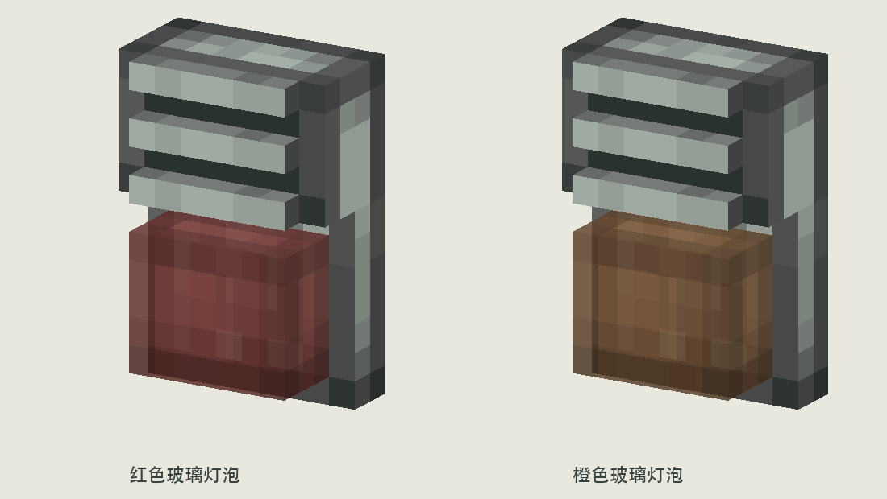

# 已确认：壁挂声光报警器 V4

2026-09-21，用户确认：“完美就它了”。本目录为后续接入的外观基准。

确认名称：**红色声光报警器**、**橙色声光报警器**。游戏内保留两个可选报警音：V2 的 B2 与已确认的 F1 对称扫频修订版。用户要求不得自动播放设计试听文件。

锁定外观：安山机身、上部立体蜂鸣器栅格、下部 6×5×3 半透明灯罩、内部 U 形灯芯；不增加下托座或铁脚。保留红／橙两种美术版本。

游戏内已接入。红石供电后按固定双闪节奏循环：亮 100ms、灭 150ms、亮 100ms、长灭 1150ms。按住右键使用 Create 原生 Value Settings 面板选择 0/1/2：0 静音、1 与 2 分别对应两套已确认报警音；面板只显示数字。亮灯状态同时使用方块光等级 15 与 FULL_BRIGHT 发光叠层，便于在光影环境中保持强烈亮度。

合成表两种颜色完全同构：安山合金 + 音符盒 + 铁粒 + 对应颜色染色玻璃板 + 红石火把，各产出 1 个。红、橙版本不互相依赖染色转换。

以下为 V4 原始美术说明。

---

# 壁挂声光报警器 V4 · 灯罩折中比例

用户认为 V3 太宽太扁，本版将灯罩从 **7×5×2 改为 6×5×3**：宽度减少 1，高度不变，厚度增加 1。保留无托座、无铁脚设计、安山机身和半透明红/橙灯罩。

灯罩范围 x=5..11、y=3..8、z=11..14，背面贴住背板，前端与上方栅条齐平。原版 3×4 U 形灯芯放在 z=12.5，处于灯罩厚度中央。

玻璃贴图沿用 Create 库存链接器纹素与 Alpha 204；正面仅增加一列中间纹素，深度保留前、中、后三列或行，不缩放纹素。灯罩各面保持 1 纹素/模型单位。

`sounder_*.json` 为四种状态模型；`textures/` 为纹理；`sounder_on_wall.png` 为壁挂示意；`sounder_side_profile.png` 为侧视；`sounder_pulse.gif` 延续亮 100ms / 灭 1400ms 的无声节奏。

运行 `python3 docs/design/concepts/wall-sounder-v4/build_art.py` 可复现。已通过模型边界与各面 UV 密度检查，并查看生成的主预览。仅美术概念资产，未接入正式游戏或音效；来源及素材许可处理延续 V2/V3。
