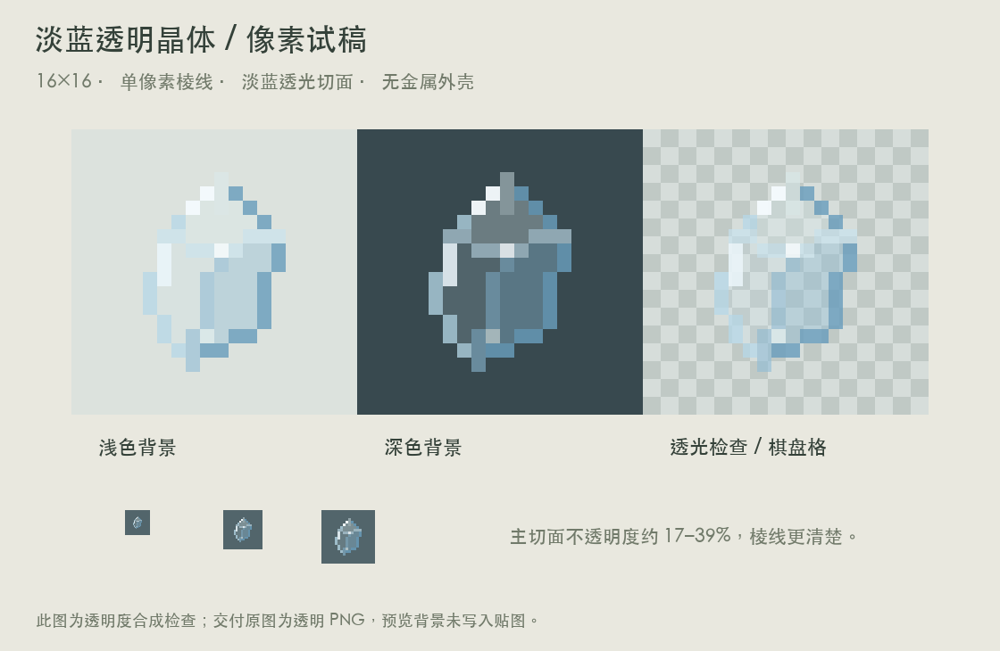

# 淡蓝透明晶体 V1 · 独立物品

用户已确认这是独立晶体物品，不是以太构件中的晶核。

- 透明原图：`assets/distantstock/textures/item/ether_crystal.png`。
- 物品模型：`assets/distantstock/models/item/ether_crystal.json`，普通 generated 物品结构，显式指定 translucent 渲染类型。
- 原生 16×16 RGBA，背景 Alpha 为 0。主切面 Alpha 为 44、80、100（约 17–39% 不透明）；单像素棱线和少量反光使用更高 Alpha。
- 使用淡蓝、冰白色，不加金属底座、光晕或高分辨率细节。轮廓是一枚倾斜的尖头棱晶，以大切面和短反光线表现透明度。
- `ether_crystal_preview.png` 展示同一张贴图在浅色、深色、棋盘格背景上的效果，背景没有写入原图。

运行 `python3 docs/design/concepts/ether-crystal-v1/build_art.py` 可复现，需要 Pillow 和本机中文字体。已核对原生尺寸、Alpha 通道与多背景合成效果。

这是美术交付包，尚未接入物品注册或正式资源；游戏中的手持透明排序与渲染效果仍需接入后验证。现有以太构件不变。
