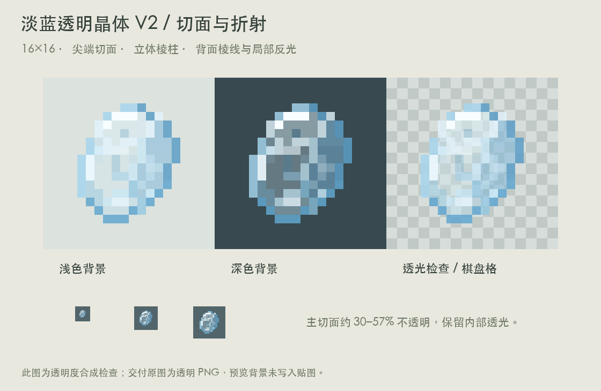

# 淡蓝透明晶体 V2

独立晶体物品。针对 V1 过于简陋的反馈，重画为较饱满的斜向棱柱：尖端由多个切面组成，主体有三组长切面与底部斜切面，内部加入背面透出的棱线、折射色块和局部高光。

保持原生 16×16，没有放大纹理或抗锯齿。主要切面 Alpha 为 77–146，约 30–57% 不透明；外棱更清楚，少量高光接近不透明。淡蓝色透光区域仍能看到背景，内部没有填成实心白色。

原图为 `assets/distantstock/textures/item/ether_crystal.png`；普通物品模型位于对应 `models/item/`，显式使用 translucent 渲染类型。

运行 `python3 docs/design/concepts/ether-crystal-v2/build_art.py` 复现。已检查浅、深、棋盘格背景及小尺寸预览。美术包尚未接入正式游戏资源或物品注册，游戏内透明渲染仍需后续验证。
