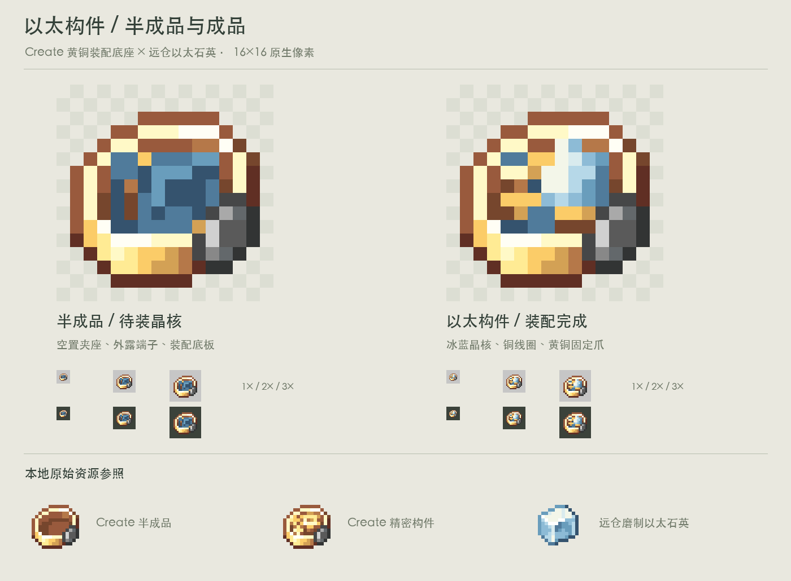

# 以太构件 V1

参照 Create 精密构件制作的一组成品与半成品。保留其黄铜底座、外轮廓和侧边铁件，重新绘制内部以太机构，确保两种状态明显属于同一装配过程。

| 状态 | 原图 | 表现 |
| --- | --- | --- |
| 半成品 | `assets/distantstock/textures/item/incomplete_ether_mechanism.png` | 蓝灰装配底板、空置晶核夹座、外露铜端子 |
| 成品 | `assets/distantstock/textures/item/ether_mechanism.png` | 冰蓝乳白晶核、铜线圈、黄铜固定爪 |

两张均为透明背景 16×16 RGBA，Alpha 仅 0/255，无抗锯齿或高分辨率缩图。外轮廓一致，变化集中在内部装配件。模型使用普通 `minecraft:item/generated`，位于对应 `models/item/`。

## 材质来源

- 外部底座与侧边铁件：本机 Create 6.0.10 的 `incomplete_precision_mechanism.png`，原始纹素保留。
- 精密构件成品贴图只用于结构参照，未直接用作成品内部。
- 晶核与内部蓝色采用仓库 `polished_ether_quartz.png` 的原有色值，重新绘制晶体形状和装配布局。
- 原始参考快照在 `reference/`，正式分发按项目既有 Create 素材许可及署名要求处理。

## 复现与验证

在仓库根目录运行 `python3 docs/design/concepts/ether-mechanism-v1/build_art.py`，依赖 Pillow、本机中文字体及 Create jar（支持 `CREATE_JAR` 环境变量）。

脚本验证原生尺寸、二值透明度与两种状态共用外轮廓。设计页包含浅深背景下的 1×、2×、3× 观察，以及 Create 精密构件、半成品和远仓磨制以太石英对照。

本目录是美术交付包，未接入正式资源、物品注册或序列组装配方。建议资源名称为 `ether_mechanism` 与 `incomplete_ether_mechanism`。
