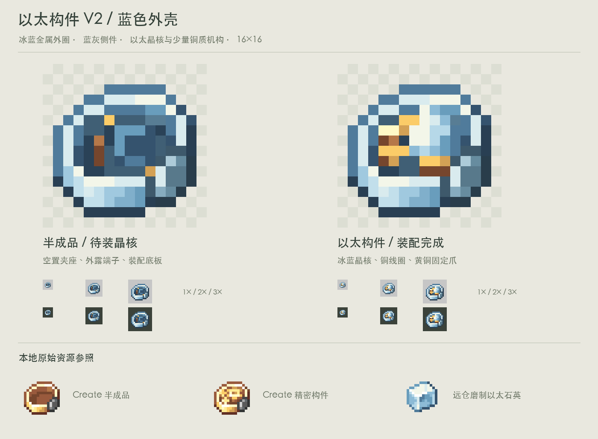

# 以太构件 V2 · 蓝色外壳

按用户要求，将 V1 黄铜外圈改为冰蓝金属，侧边铁件也改为蓝灰色；内底板略暗以区分壳体与夹座。原有轮廓、明暗位置与透明度保持一致。成品的以太晶核、内部铜线圈和固定爪保留，半成品保留空夹座与外露端子。

16×16 透明原图：

- `assets/distantstock/textures/item/incomplete_ether_mechanism.png`
- `assets/distantstock/textures/item/ether_mechanism.png`

普通物品模型在对应 `models/item/` 目录。两种状态保持相同外轮廓，并已检查原生尺寸与二值 Alpha。

复现：`python3 docs/design/concepts/ether-mechanism-v2/build_art.py`。底座源自本机 Create 6.0.10 半成品精密构件，结构保留、重新配色；原始素材参照在 `reference/`。正式分发按项目既有素材许可及署名要求处理。尚未接入游戏资源或配方。
