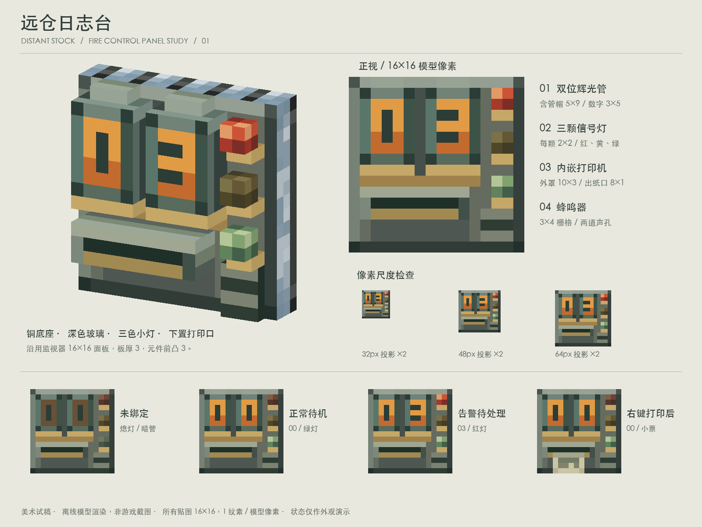

# 远仓日志台 · 面板容量试稿 V1



结论：监视器同规格的 16×16 面板可以放下 **两位迷你辉光管、三颗信号灯、小票打印口和蜂鸣器**。三灯版作为本轮建议。布局已接近满载，不再增加按钮、文字标签或第四颗灯。

这是独立美术试稿，不修改 Java、注册、方块状态或现有监视器资产；未安装到游戏。截图由项目离线渲染器生成，不是游戏截图。

## 像素与模型尺寸

所有贴图均为 16×16 PNG 图集，UV 使用其中的实际尺寸区域；**1 个纹素对应 1 个模型单位，16 单位为一格**。没有把 16×16 材质压进一个小灯泡。小尺寸预览使用最近邻显示。

以下坐标是面向面板的左上角坐标，区间右端不包含在内：

| 元素 | 占位 / 模型单位 | 位置 |
| --- | --- | --- |
| 面板 | 16×16，厚 3 | x=0..16，y=0..16；模型 z=13..16 |
| 左辉光管 | 5×9，含顶帽与铜底座 | x=1..6，y=0..9 |
| 右辉光管 | 5×9，含顶帽与铜底座 | x=7..12，y=0..9 |
| 管内数字 | 每位 3×5 | 一像素粗的橙色字形 |
| 红 / 黄 / 绿灯泡 | 各 2×2，铜座另占一行 | x=13..15；y=1..3、5..7、9..11 |
| 打印机罩 | 10×3 | x=1..11，y=10..13 |
| 出纸缝 | 8×1 | 位于打印机罩内 |
| 已打印小票 | 6×4 | x=3..9，y=12..16 |
| 蜂鸣器栅格 | 3×4 | x=12..15，y=12..16 |

主体元件前端到 z=10，即在板面前突出 3 单位；打印后的折纸到 z=9。所有模型元素都在 0..16 方块范围内。管帽落在上边框，蜂鸣器和纸张利用下边缘；这也是本方案能容纳三颗灯的原因。

辉光管采用自绘微型版本：深绿灰玻璃观感、橙色数字、铁顶帽和黄铜脚座。为保持低分辨率的可读性，本稿以不透明像素表现玻璃，没有叠加半透明壳或屏幕泛光。原版 Create 的管壳为 6×9，另有 3 高底座；本稿不是原版管子的等比缩放。

## 状态外观示意

| 模型 | 示意 |
| --- | --- |
| `logger_offline.json` | 暗管、熄灯 |
| `logger_idle.json` | 00，联网绿灯 |
| `logger_alarm.json` | 03，告警红灯与联网绿灯 |
| `logger_fault.json` | 02，故障黄灯与联网绿灯 |
| `logger_printed.json` | 00，红灯熄灭、绿灯保留，打印口挂出小票 |

数字暂作未处理事件数量的视觉示例。红灯告警、黄灯故障、绿灯联网是美术建议；数字更新、灯光闪烁、蜂鸣器声音，以及“右键打印后消除事件”的交互均未实现。

小票只用两行灰色短线表达记录，不尝试在六像素宽纸面上画可读文字。待机状态不挂纸，让打印后的小票成为明确的状态变化。

## 文件与复现

- `logger_design_sheet.png`：三分之四视角、正视、32/48/64px 投影和状态示意。
- `logger_front.png`、`logger_three_quarter.png`：单独大图。
- `lamp_comparison.png`：两灯 / 三灯容量对照。
- `readability.png`：小尺寸辨识度对照。
- `logger_*.json`：原生 Minecraft 方块元素格式，使用暂存命名空间 `logger_study:`。
- `textures/`：36 张 16×16 贴图，含 0–9 明暗数字备选。
- `build_art.py`：可复现的模型、纹素绘制与渲染源文件。

在仓库根目录运行：

```sh
python3 docs/design/concepts/logger-console-v1/build_art.py
```

依赖 Pillow、NumPy、项目的 `scripts/concepts/render_scene.py` 和本机中文字体。脚本检查全部模型边界，以及每个面 UV 的纹素密度。面板侧面与背面来自仓库当前 `monitor_side.png` 和 `andesite_block_white_blue.png`，按原始分辨率复制；其他贴图为本试稿绘制。运行时无需 Create jar。

正式接入时，需要将 `logger_study:` 材质引用改为实际资源路径，并由游戏逻辑驱动数字和状态。本稿只验证离线外观与几何，不包含游戏内光照、实际距离或资源加载验证。
