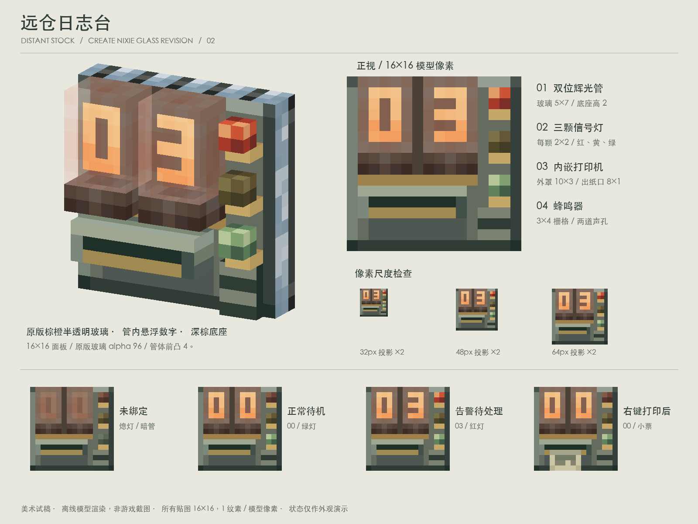
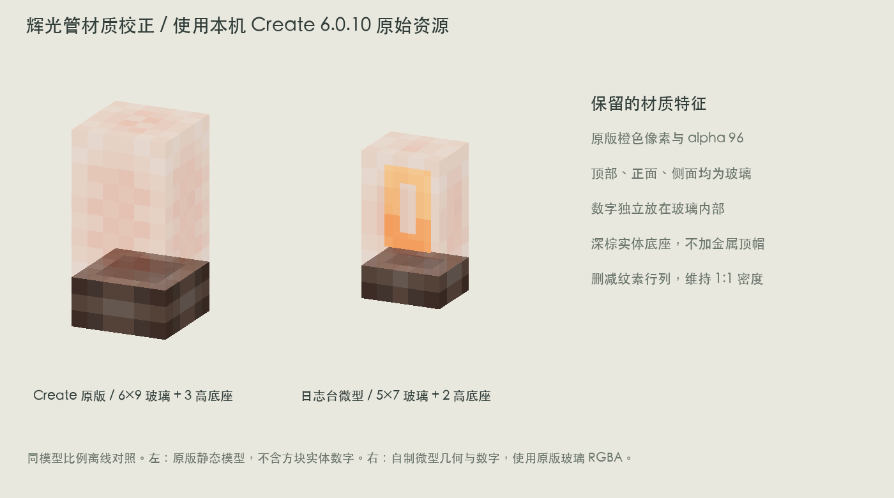

# 远仓日志台 V2 · Create 辉光管材质修订

根据用户指出的“半透明棕橙色玻璃管”修订。V1 的深绿不透明数字窗方案已被本版替代。

## 原版资源分析

直接读取本机 Create 6.0.10 jar 中的 `assets/create/textures/block/nixie_tube.png` 与 `assets/create/models/block/nixie_tube/block.json`，快照保存在 `reference/`。

- 原贴图为 16×16；玻璃侧面取 UV `[0,1,6,10]`，即 6×9 纹素。
- 玻璃主体像素 Alpha 为 96/255，约 **38% 不透明、62% 透明**。RGB 主要为浅桃橙、橙色，在暗背景与多面叠加下呈现棕橙色。
- 玻璃为完整方形管壳，顶面、前面、侧面均透明，没有实体铁顶帽。
- 管壳与底座分别位于 `tubes`（`minecraft:translucent`）和 `connectors`（`minecraft:solid`）两个子模型中。
- 原版玻璃 6×9×6、底座 6×3×6。底座是深棕色实体，带较浅色横带。原版静态模型不包含数字。

## 本版落地

保持原来的 16×16 面板布局，两位管子各占 5×9：玻璃 5×7×4，底座 5×2×4。删除 V1 铁顶帽、绿灰实体管框和印在玻璃上的数字。

玻璃和底座直接选用原版纹素，删减部分内部行列来适配小尺寸，**保留原始 RGBA，不进行缩放或重采样**。每张输出图集仍为 16×16，每个纹素对应一个模型单位。

每位数字是独立透明底 3×5 像素字形，位于前玻璃后方 1 个模型单位；可以从侧面看到它与玻璃面的距离。管后安装区域改为棕灰色，使装在面板上的透明玻璃呈现棕橙观感。打印口、三灯布局和蜂鸣器沿用 V1。

`logger_*.json` 使用 NeoForge composite 结构：实体底座、面板和数字放在 cutout 子模型，玻璃放在 translucent 子模型。暂存命名空间为 `logger_study:`，尚未接入游戏资源。亮数字在离线预览中使用全亮颜色示意；真实游戏内数字更新、发光、闪烁和交互需要后续实现。

## 文件

- `logger_design_sheet.png`：更新后的完整设计与状态图。
- `create_nixie_comparison.png`：原版单管与本版微型管按相同模型尺度对照；左侧不含原版动态数字。
- `logger_front.png` / `logger_three_quarter.png`：独立视图。
- `lamp_comparison.png` / `readability.png`：两灯与三灯、小投影检查。
- `logger_offline.json` / `logger_idle.json` / `logger_alarm.json` / `logger_fault.json` / `logger_printed.json`：五种美术状态。
- `textures/`：41 张原生密度贴图；`reference/`：Create 原始资源快照。

复现：在仓库根目录执行 `python3 docs/design/concepts/logger-console-v2/build_art.py`。依赖 Pillow、NumPy、本项目离线渲染器、本机中文字体和 Create jar；jar 路径可用 `CREATE_JAR` 环境变量指定。

已验证模型边界为 0..16、所有面纹素密度为 1:1，且玻璃采用原版 RGBA。图片是离线渲染，未做游戏内验证。本轮仅新增美术概念文件。原版材质出处保留，正式分发依项目既有许可与署名要求处理。
