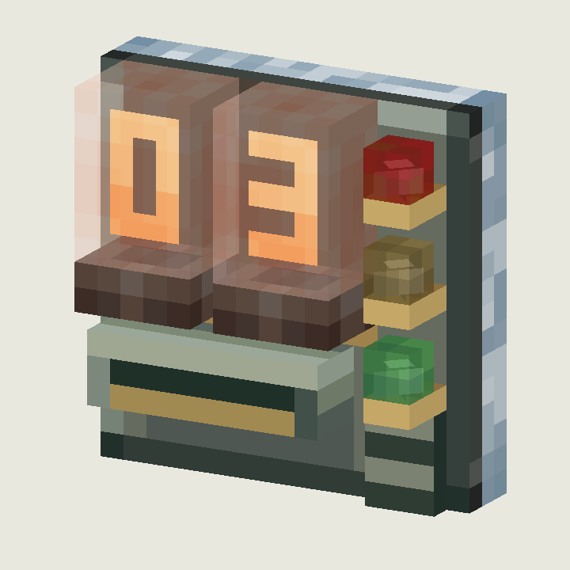
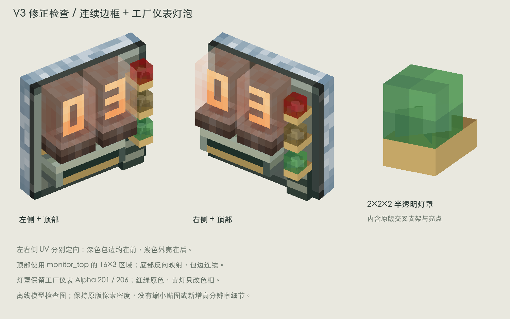

# 远仓日志台 V3 · 边框 UV 与工厂仪表灯泡

本轮修正侧面边框前后颠倒、顶部边条重复，以及三颗信号灯不透明的问题。辉光管保持 V2 的半透明棕橙玻璃结构。仅新增美术概念文件，未修改游戏代码或正式资源。

## 边框

原因：V2 让板体除正背面之外的各面共用 `monitor_side`。它的三像素侧边条横向重复，直接用于 16×3 顶面后产生了斑马线；左右侧又用了相同的 UV 方向。

修正后的正面朝模型 -Z，板体 z=13..16：

| 面 | 贴图 | UV |
| --- | --- | --- |
| west | 原监视器 `monitor_side` | `[3,0,0,16]` |
| east | 原监视器 `monitor_side` | `[0,0,3,16]` |
| up | 原监视器 `monitor_top` | `[0,0,16,3]` |
| down | 原监视器 `monitor_top` | `[0,3,16,0]` |

四个面的深色包边都朝前，浅蓝灰外壳都在后。顶部采用专用贴图，不再重复侧边条；底部也做了对应的前后方向校正。

## 三颗灯泡

直接参考本机 Create 6.0.10 的 `factory_gauge/bulb_light`、`bulb_red` 和 `panel_with_bulb`，原始 JSON 与贴图已存入 `reference/`。

- 灯罩使用原版 2×2×2 尺寸，置于 translucent 子模型。修正了 V2 灯体深度为 3、侧面超出 2×2 色块的问题。
- 绿灯原样使用 `factory_panel.png` 的 `[9,8,11,10]` 区域，红灯原样使用 `[11,8,13,10]` 区域，保留每个像素的 RGBA 和各面的 UV 旋转。
- 灯罩原生 Alpha 为 201 / 206，约 79–81% 不透明；不套用辉光管更浅的透明度。
- 黄灯由绿灯修改色相得到，明度、饱和度、Alpha 保持来源数值。
- 灯罩内部移入原版工厂仪表的 1×1 亮点与两片交叉支架，三个元素仅平移，不缩放、不改 UV 或局部旋转。
- 黄铜安装座保留日志台原有设计，向前延伸一单位承接支架。灯罩内可以看到支架和亮点。

五种外观状态保持 V2。亮灯与亮数字仅在离线渲染中采用全亮颜色示意；动态发光、状态切换及交互尚未接入游戏。

## 查看与复现

- `logger_design_sheet.png`：完整设计页。
- `logger_three_quarter.png` / `logger_front.png`：主视图与正视图。
- `logger_left_top.png` / `logger_right_top.png`：左右边框、顶边检查。
- `uv_and_lamp_details.png`：双侧 UV 校正与独立灯泡放大图。
- `logger_*.json`、`textures/`：五个美术状态模型与 43 张 16×16 贴图，暂存命名空间 `logger_study:`。

仓库根目录运行 `python3 docs/design/concepts/logger-console-v3/build_art.py`。需要 Pillow、NumPy、项目离线渲染器、本机中文字体、Create jar（可通过 `CREATE_JAR` 指定）。

已检查所有模型在 0..16 范围内，每个面的纹素密度均为 1:1；红绿灯 RGBA 与工厂仪表原始纹素一致。已人工检查左右和顶部预览。未做游戏内渲染验证，正式分发的 Create 素材按项目既有许可与署名要求处理。
