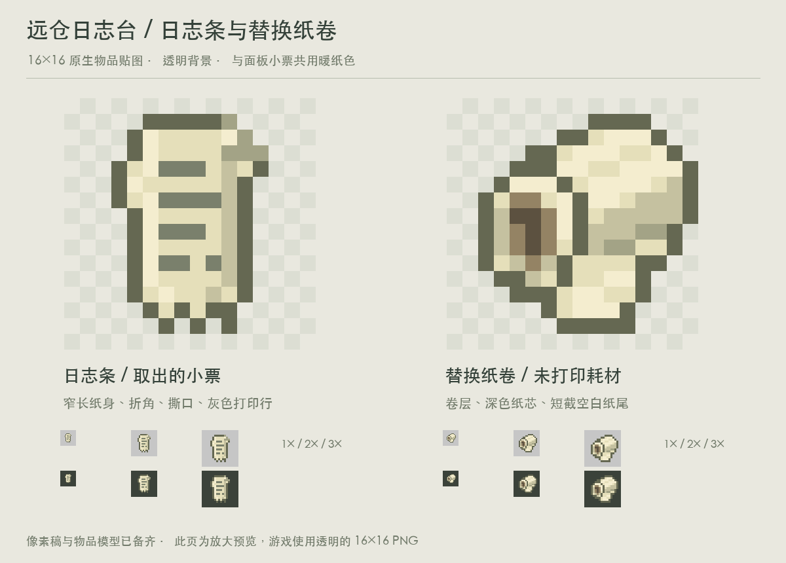

# 日志台物品贴图 V1

两张透明背景的原生 16×16 RGBA 贴图，与日志台 V3 小票共用纸色 `#e5dfba`。所有像素直接绘制，无抗锯齿、渐变或高分辨率缩图；Alpha 仅为 0 / 255。

| 物品 | 贴图 | 设计 |
| --- | --- | --- |
| 日志条（打印后取出） | `assets/distantstock/textures/item/event_receipt.png` | 窄长纸身、小折角、撕口、灰色打印行 |
| 替换纸卷（未打印） | `assets/distantstock/textures/item/logger_paper_roll.png` | 斜向纸卷、可见纸芯、卷层阴影、短截空白纸尾 |

两张图均配有 `assets/distantstock/models/item/` 下的 `minecraft:item/generated` 模型，可用于普通手持与物品栏显示。日志条沿用仓库已有 `event_receipt` 物品命名；纸卷使用建议名 `logger_paper_roll`。

本目录是美术交付包，`assets/` 目录结构与资源目录对应，尚未复制到正式 `src/main/resources`。仓库现有日志条模型仍引用原版纸张；替换纸卷尚无物品注册。本轮不修改 Java 或交互。

在仓库根目录运行 `python3 docs/design/concepts/logger-items-v1/build_art.py` 可重建全部文件，需要 Pillow 和本机中文字体。脚本验证 16×16 尺寸与二值透明度；设计页包含浅色、深色背景下的 1× / 2× / 3× 检查。

`logger_items_preview.png` 与 `logger_items_design_sheet.png` 仅用于查看，游戏应使用 `textures/item/` 中的透明原图。
