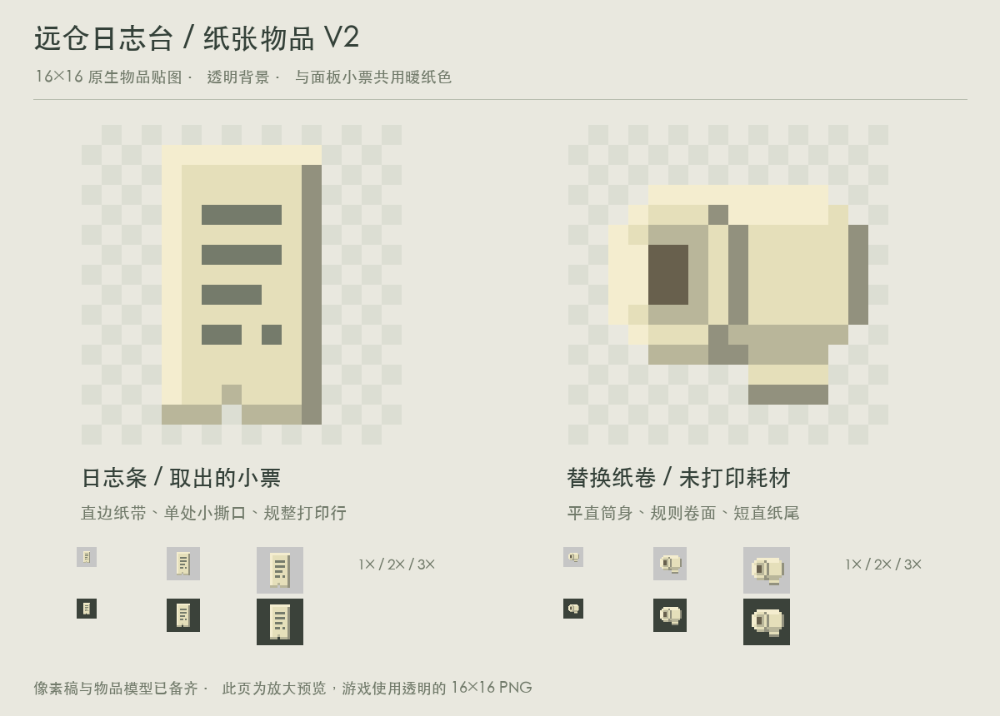

# 日志台纸张物品 V2

针对 V1 轮廓像“融化”的反馈，重新绘制形状和明暗：

- 日志条改为两侧平直的窄纸带，取消折角鼓包和多齿下摆，仅保留一个一像素小撕口；打印行规则排列。
- 纸卷改为水平圆柱，端面采用对称阶梯椭圆，筒身上下沿平行；纸芯形状简化，纸尾收为短直片。
- 移除原稿深绿粗描边和零碎阴影，保留纸面、亮边、阴影等清楚的大色块。

文件仍是原生 16×16、二值透明的 RGBA PNG，纸面颜色 `#e5dfba` 与日志台小票一致。原图位于 `assets/distantstock/textures/item/event_receipt.png` 和 `logger_paper_roll.png`，普通手持物品模型位于对应 `models/item/` 下。

运行 `python3 docs/design/concepts/logger-items-v2/build_art.py` 可复现。已查看浅深背景下 1×、2×、3× 效果，验证尺寸与透明度。仅更新独立美术交付目录，未接入正式游戏资源。
