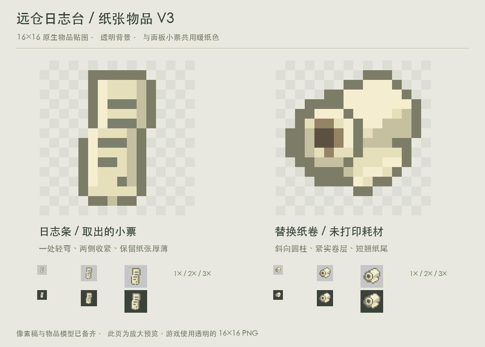

# 日志台纸张物品 V3

以 V1 的自然形态为基础调整，不采用 V2 的全直纸带与水平圆柱。

- 日志条保留一处轻微弯曲，两侧大致平行；收掉外鼓边缘和多齿下摆，减少碎阴影。
- 纸卷保留斜向透视与可见纸芯，外圈轮廓收紧；纸尾缩短并轻翘，不再向下松垂。
- 保持 16×16 像素、透明背景与日志台暖纸色。描边略浅于 V1，避免像厚重软块。

原图位于 `assets/distantstock/textures/item/`，物品模型位于对应 `models/item/`。执行 `python3 docs/design/concepts/logger-items-v3/build_art.py` 可复现；脚本验证原生尺寸及二值透明度，设计页提供 1×、2×、3× 显示检查。

本版仍为独立美术交付，不修改正式游戏资源或程序。
