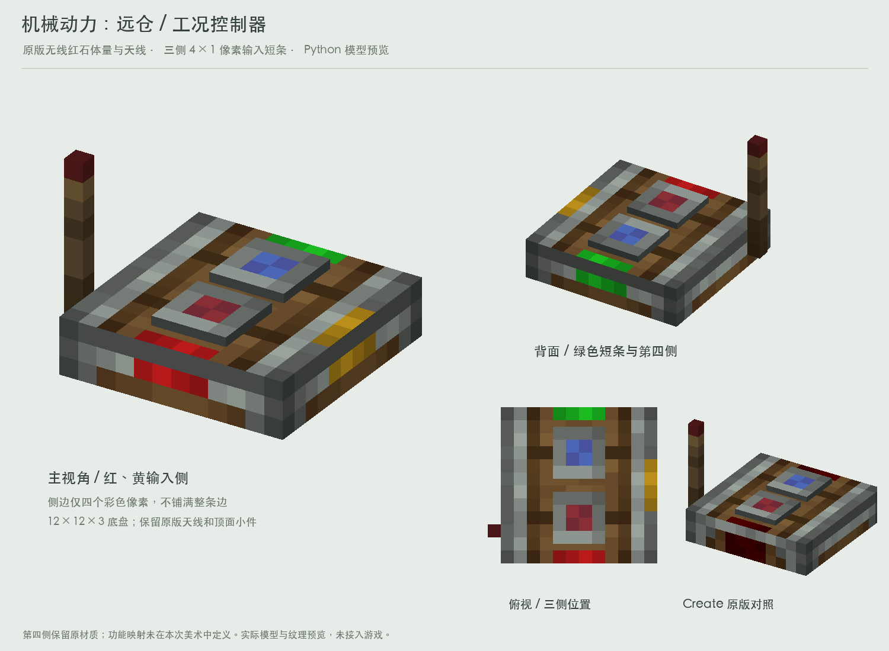

# 工况控制器 V1：无线红石外形，三色侧边短条

本轮仅为美术方案，未实现红石输入、无线控制、灯色映射或第四路业务。用户要求外形类似Create无线红石，带天线，三个侧面用红黄绿短条引导接线，标记不能铺满整边。

## 模型与贴图

- 几何完全沿用Create 6.0.10 `redstone_link/transmitter`：12×12、厚3单位底盘，原版交叉贴片天线和顶面两个小件。天线最高至y=11。
- 所有面保持1纹素/模型单位。原版32×32图集的UV保留密度，新侧面图集16×16中仅使用12×3区域；没有将完整纹理缩放到小部件上。
- 本地北侧红、东侧黄、南侧绿、西侧无彩色标识。方向只是本次预览摆放方案，后续可随方块朝向整体旋转。
- 三侧标记各4×1纹素，位于12×3侧面的中间一行，横向x=4..7；每侧仅改4/36个像素。第四侧保留原底材，不在美术任务中定义其功能。
- 顶面对应边缘增加同样4×1的标记，便于玩家俯视接线；原先较大的红色装饰改为木色，使新短条成为侧面信号标识。
- 短条明暗分布参考原版打包机 `packager_horizontal_powered.png` 的 `[5,12,9,13]` 四像素裁片，变换为红黄绿，未重采样。标记是绘制在外壳贴图上的引导色，不新增发光几何。
- 材质仍是原版安山边框、木色底板、棕色天线；没有增加显示屏或大型彩色面板。

## 文件

- `controller-model.json`：实际预览模型。`condition_study:`仅为美术命名空间，接入时需改为正式资源路径。
- `textures/`：本次预览实际使用贴图。
- `controller-design-sheet.png`：主视图、背面、俯视和原版对照。
- `controller-front.png`、`controller-back.png`：单独模型预览。
- `side-strip-details.png`：四边展开，便于检查彩色短条尺寸。
- `reference/`：本机Create原版模型、材质及打包机短条裁片，用于来源对照。
- `render_preview.py`：调用项目 `scripts/concepts/render_scene.py`，从本机Create jar生成本目录的资源和预览。需要Pillow、NumPy及项目 `create_context.py` 所配置的Create jar。

复现：`python3 docs/design/concepts/operating-condition-controller-v1/render_preview.py`。

脚本核对几何与原版逐部件一致、全部面UV密度为1纹素/单位、每个标记侧面只改4个像素。未修改正式资源、程序或其他美术方案。保留Create素材来源；正式分发时沿用工程现有的许可与署名处理。
