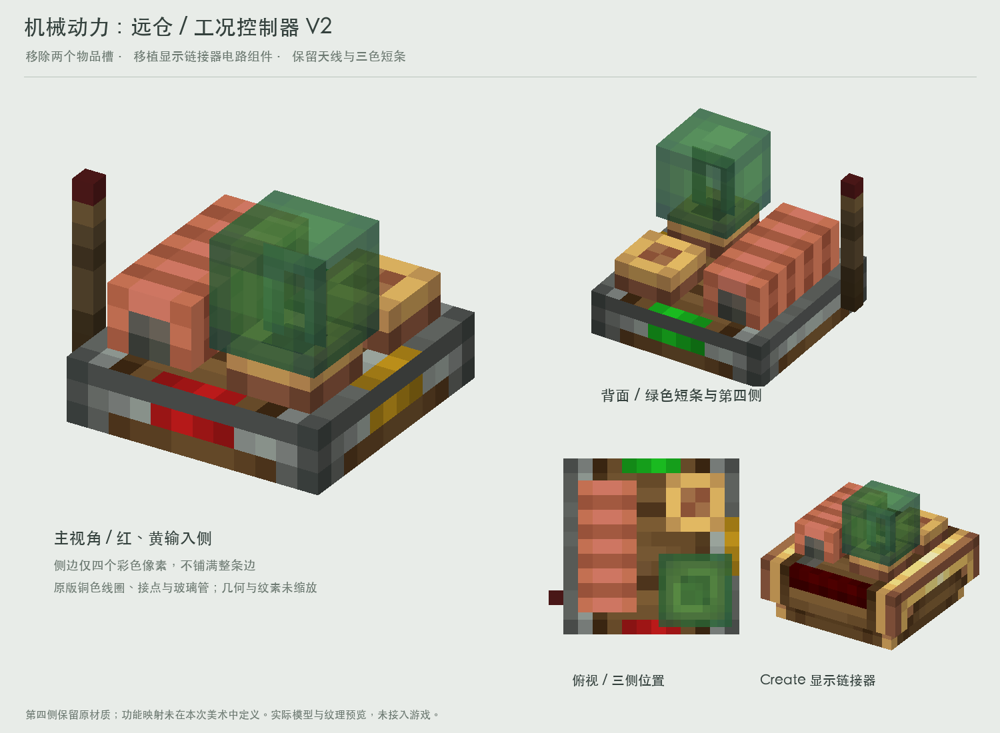

# 工况控制器 V2：显示链接器电路组件

按用户要求，移除V1顶面两个放物品的板子，替换为Create显示链接器上方的原版组件。底盘、无线红石天线和三侧红黄绿短条保持V1。

## 改动

- 从原版`redstone_link/transmitter`仅保留底盘与3个天线元素，去掉最后两个物品槽元素。
- 从`display_link/block`的`children.base.elements[2:]`提取铜色线圈、玻璃管底座、另一接点和管内原版平面细节；再提取`children.bulb.elements`的绿色玻璃管外壳，共5个原版部件。
- 原显示链接器顶面y=5，而本控制器顶面y=3，因此所有移入部件只平移`[0,-2,0]`，不缩放、不重画UV、不改变部件尺寸和相对位置。
- 材质直接使用原版`link_details.png`快照，保留透明度和像素分布。本组件保留显示链接器原生管内平面细节，与三色灯的单层灯罩方案是不同的模型。
- 底盘仍12×12×3，天线最高y=11，电路组件最高y=10；整套没有超出原天线高度。
- 红/黄/绿三侧短条、上沿对应标记和第四侧未标记材质，与V1逐像素一致。

## 文件与复现

`controller-model.json`是预览用NeoForge composite结构，8个不透明/裁切元素与1个半透明管壳分开。`condition_study:`引用需要正式接入时替换；本轮未修改游戏注册或程序。

`textures/`包含实际预览材质；`reference/`包含原版模型与素材参照。设计页右下展示Create原版显示链接器，便于比对电路组件。`controller-front.png`和`controller-back.png`为单独预览。

运行 `python3 docs/design/concepts/operating-condition-controller-v2/render_preview.py`，使用项目 `scripts/concepts/render_scene.py`。需要Pillow、NumPy和本机Create 6.0.10 jar。

脚本检查原底盘/天线坐标不变、两个物品槽移除、5个原版组件仅平移、UV保持1纹素/模型单位、各标记侧仍仅着色4个像素。Create材质出处保留，正式分发按项目既有许可与署名处理。
