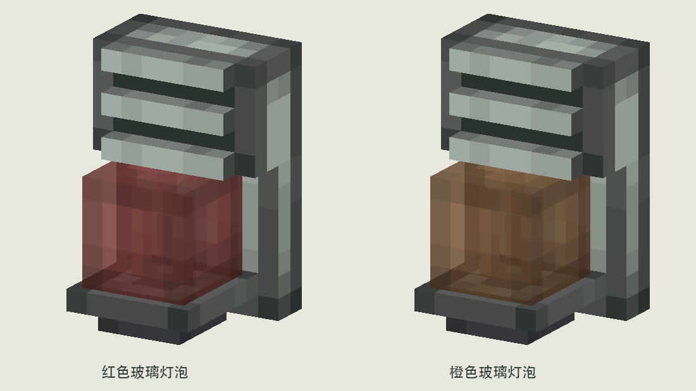

# 壁挂声光报警器 V2 · 安山主题立体模型

根据用户修订，取消 V1 的平面灯窗，改为真实壁挂几何：安山机壳、实体蜂鸣器栅格、凸出玻璃灯泡及深灰铁座。外壳不使用黄铜或蓝色金属。

## 尺寸与结构

- 整体正视 8×12 模型单位，半格宽、四分之三格高。
- 背板：x=4..12，y=2..14，z=14..16，背面贴墙。
- 上部蜂鸣器：x=4..12，y=9..14，z=12..14；三根栅条前凸至 z=11，在两条声孔中可以看到后方的暗色凹面。
- 下部灯罩：5×5×5，x=5.5..10.5，y=4..9，z=8.5..13.5，相对背板正面前凸 5.5。
- 灯芯：3×4 单面厚度为零的 U 形切出平面，位于玻璃内部 z=11，与前玻璃相距 2.5 单位。来自原版，不是新增的不透明内胆。
- 安山托座承托灯泡，底部为深灰铁件；模型整体不超出 0..16 的方块空间。

顶部、侧面在背板与蜂鸣器前壳之间使用连续 UV，避免把边框在接缝处重复成条纹。

## Create 原始资源参照

读取本机 Create 6.0.10；参照资源快照在 `reference/`：

- 工厂仪表 `factory_gauge/bulb_red`、`panel_with_bulb`：了解独立玻璃罩与内部灯芯的结构。
- 库存链接器 `stock_link/block_vertical`：使用其原生 5×5×5 灯泡几何，平移 `[-3,-2,+6]`，不进行几何缩放。
- 显示链接器 `display_link/block`：同类玻璃壳与独立灯芯参照。
- `link_details.png`：灯罩侧面取原图 `[27,5,32,10]`，顶部 `[27,0,32,5]`，底部 `[27,10,32,15]`，灯芯 `[23,12,26,16]`。

所有小图块原尺寸移入 16×16 图集，**每个模型单位对应一个纹素**。玻璃保留原版 Alpha 204 与底部透明开口，只改变色相为红/橙。亮灯版本增加明度，仍保留相同 Alpha，灯芯变亮；离线预览对亮灯材质使用全亮着色示意，不代表已经实现游戏发光逻辑。

安山纹理来自 Create `andesite_block`，铁座来自 `industrial_iron_block`；小型边框通过删去原纹理中间行列取得，没有缩小原纹素。正式分发按项目既有 Create 素材许可与署名要求处理。

## 交付与复现

- `sounder_red_off.json`、`sounder_red_on.json`、`sounder_orange_off.json`、`sounder_orange_on.json`：四种美术状态。
- `textures/`：16×16 贴图图集。
- `sounder_preview.png` / `sounder_design_sheet.png`：主预览与设计说明。
- `sounder_front.png` / `sounder_opposite_side.png`：正面与另一侧。
- `sounder_on_wall.png`：放在一格铁墙前的大小示意。
- `sounder_pulse.gif`：无声立体短闪示意，灭 1400ms / 亮 100ms。

运行 `python3 docs/design/concepts/wall-sounder-v2/build_art.py` 复现。依赖 Pillow、NumPy、项目离线渲染器、本机中文字体与 Create jar（可用 `CREATE_JAR` 指定）。

已检查全部面 UV 密度为 1:1，元素位于方块边界内；已查看主视图、壁挂示意和亮灯状态。玻璃与固体分别存放在 NeoForge composite 的 translucent / cutout 子模型，暂存命名空间为 `sounder_study:`。

这是离线美术模型，没有接入方块注册、朝向、告警触发、游戏发光或声音。后续音效需求保留：明显但柔和的短提示音、缓起音、避免尖锐警笛和爆裂瞬态；当前 GIF 无声。
