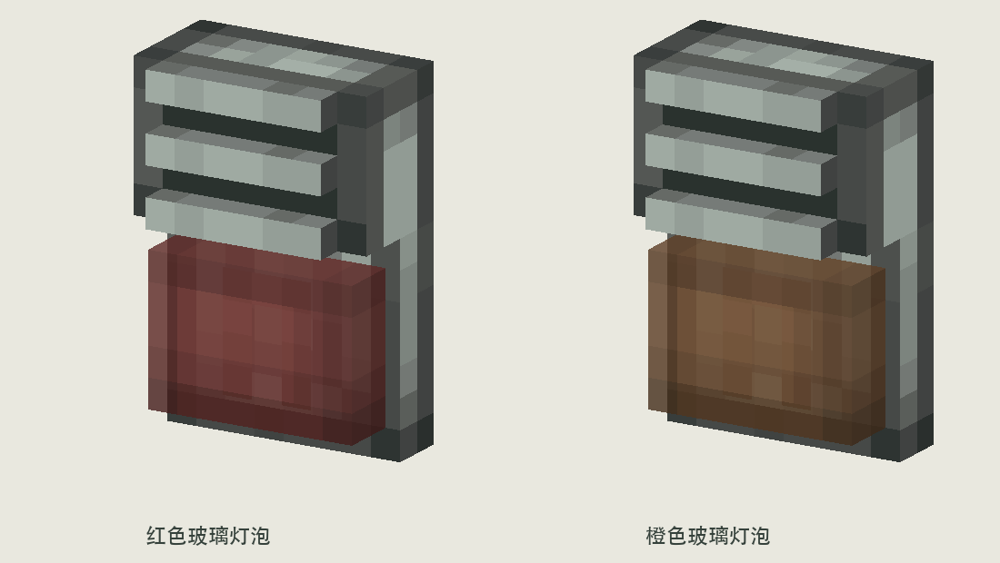

# 壁挂声光报警器 V3 · 无底座宽扁灯罩

按用户要求调整 V2：

- 删除灯泡下方的安山托座与铁脚，不保留向前伸出的底座。
- 灯罩从 **5×5×5** 改为 **7×5×2**，横向加宽，高度不变，厚度显著减小。
- 灯罩移到 x=4.5..11.5、y=3..8、z=12..14，背面直接贴到机身；相对背板前凸从 5.5 减少为 2，其前面与蜂鸣器外壳正面齐平。
- 原版 3×4 U 形灯芯移到薄灯罩内部 z=13，距前玻璃 1 单位。
- 保持安山机身、格栅、8×12 整体正视尺寸、红/橙配色和 100ms 亮 / 1400ms 灭的闪光示意。

灯罩纹理仍取自 Create 库存链接器：正面增加两列中间纹素，侧面和上下表面取边缘纹素，保持 1 纹素/模型单位，不拉伸原图。原底部开孔改为封闭玻璃底面；玻璃沿用 Alpha 204，亮灯仅调整颜色和灯芯亮度。

`sounder_*.json` 为四种状态模型，`textures/` 为素材；`sounder_side_profile.png` 可查看减少后的厚度，`sounder_on_wall.png` 为壁挂示意，`sounder_pulse.gif` 为无声短闪预览。

执行 `python3 docs/design/concepts/wall-sounder-v3/build_art.py` 可复现。已验证 UV 密度、模型边界并查看主预览。沿用 V2 的 Create 资源来源，快照在 `reference/`；正式分发按项目既有许可与署名要求处理。

仅美术概念文件，未接入正式游戏模型、触发逻辑或声音。
