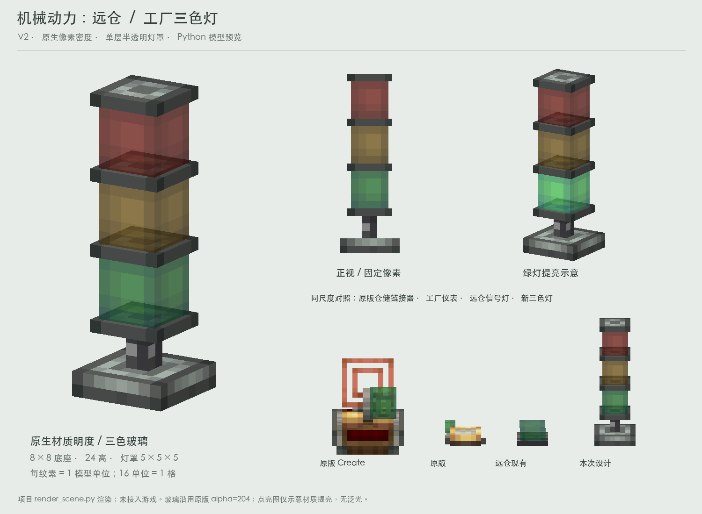

# 工厂三色灯：用户最终选择 V2

用户最终指令：**“算了要v2，把v2整理整理然后我让其他agent做出来”**。

本目录是正式开发的美术交接基准。V3 黄铜环、V4 加宽蜂鸣器座、V5 黄铜顶盖及加高灯座均不采用。程序开发尚未开始；本交接仅冻结外观，不替用户定义报警、灯色、红石或蜂鸣器业务。

用户随后追加并纠正贴墙与倒装要求，见 [安装姿态补充](mountings/README.md)：贴墙底座贴墙、支柱转90°托起向上的竖直灯体；倒装交换红绿位置，三种姿态均保持上红、中黄、下绿。立式V2美术基准不变，新增姿态的修订预览尚待用户审阅。

## 外观必须保持

- 按世界竖直方向，立式、贴墙和倒装均从上到下红、黄、绿；倒装要交换红绿位置及其逻辑信号绑定。墙装灯体保持竖直向上。
- 安山安装脚、安山薄顶盖及三片隔托，工业铁短支柱；没有黄铜。
- 绿灯下方是原来的薄托：6×6×1，没有加高、外扩、开孔或额外蜂鸣器结构。
- 灯罩各为5×5×5的单层半透明壳。没有独立灯芯、内部发光方块、第二层壳或额外高光线条。
- 全部新模型表面1纹素/模型单位；16单位为1格。保留原生像素，不插值、不缩放整张贴图去覆盖小部件。

## 尺寸和坐标

模型以方块中心X=8、Z=8对称，Y=0为安装面；总高24单位（1.5格）。以下是美术几何，碰撞和放置规则尚未决定。

| 部件 | from | to | 尺寸 |
|---|---|---|---|
| 安山安装脚 | 4,0,4 | 12,2,12 | 8×2×8 |
| 工业铁支柱 | 7,2,7 | 9,5,9 | 2×3×2 |
| 绿灯下托 | 5,5,5 | 11,6,11 | 6×1×6 |
| 绿灯罩 | 5.5,6,5.5 | 10.5,11,10.5 | 5×5×5 |
| 绿黄隔片 | 5,11,5 | 11,12,11 | 6×1×6 |
| 黄灯罩 | 5.5,12,5.5 | 10.5,17,10.5 | 5×5×5 |
| 黄红隔片 | 5,17,5 | 11,18,11 | 6×1×6 |
| 红灯罩 | 5.5,18,5.5 | 10.5,23,10.5 | 5×5×5 |
| 顶盖 | 5,23,5 | 11,24,11 | 6×1×6 |

尺寸列顺序为X×Y×Z。半单位位置用于把奇数宽的灯罩居中，不改变纹素密度。

## 文件清单

| 文件 | 用途 |
|---|---|
| `three-quarter.png` | 用户选择的V2单独预览，验收外观基准 |
| `factory-stack-light-v2.png` | V2设计页，含正视、绿灯提亮和同尺度原版参照 |
| `models/model-off.json` | 完整9部件/54面的基准几何与UV |
| `models/model-{red,yellow,green,all}.json` | 相同几何，只切换相应灯罩的明度贴图 |
| `textures/` | 全部预览材质快照，16×16，UV仅取有效小区域 |
| `renderer/render_scene.py` | 项目Python渲染器快照，未改绘制算法 |
| `renderer/render_preview.py` | 仅依赖交接包即可重渲染与验证，无需Create jar |
| `manifest.json` | 文件SHA-256及来源摘要，用于确认交接内容未漂移 |
| `IMPLEMENTATION-PROMPT.md` | 可直接转交给开发agent的接入说明 |
| `mountings/`、`renderer/render_mountings.py` | 新增贴墙/倒装预览、六方向变换数据与复现脚本 |

模型中的`study:`是预览命名空间，**不得原样放进正式资源目录**。模型的纹理引用可映射为`distantstock:block/factory_stack_light/<贴图名>`，实际注册名由接手方结合当前工程确定。

## 接入提示

1. 先阅读当前工程和其他agent正在改的报警/信号系统，确定这是哪个新方块，避免覆盖现有独立信号灯和四分格面板灯。这里提供外观，不要求重构业务。
2. 拷贝几何和UV，调整资源引用；为新增方块配置blockstate、物品模型及物品展示变换。总高度超出1格，物品栏需要合适缩放。
3. 建议将6个不透明金属部件与3个透明灯罩分开处理，使用项目适配的NeoForge composite或现有渲染方案。机身采样区域alpha=255，灯罩为204，不要丢失透明度或凭空加内芯。
4. 保持三灯独立。提供的`off/red/yellow/green/all`只是视觉样例，**不是已确定的五态业务枚举**。是否允许组合点亮、如何闪烁、是否发声、对应哪些事件，应接入用户另行确定的程序设计。
5. `on`贴图目前只提亮颜色并保持alpha=204。是否使用全亮顶点光照、方块光照等级或特殊发光层，需要游戏中核对；离线图没有实现动态照明或泛光。
6. 长24单位的模型需要程序侧明确相应朝向的空间检查、碰撞/选取范围、放置/拆除与朝向。不要仅靠模型越界就宣称这些行为已完成。当前立式外观已确认，新增贴墙和倒装方案见`mountings/README.md`；三种姿态都可能超出单格边界。
7. 游戏验收至少查看默认与点亮状态、透明排序、UV像素密度、物品栏显示、选取/碰撞和资源缺失日志。保留其他agent的工作。

## 自包含复现与验收

需要Python 3、Pillow、NumPy。在任意位置运行本目录`renderer/render_preview.py`，输出到`verification/`，不覆盖确认图。

脚本检查五套状态的几何/UV一致、所有54个面均为1纹素/模型单位、灯罩非透明像素alpha=204及机身alpha=255，并要求重渲染的关闭状态与确认图逐像素一致。灯罩底面原生5×5裁片含16个alpha=204像素和9个alpha=0像素，保留其镂空布局；其余五面为25个alpha=204像素。它可验证美术交接，不能代替游戏内测试。

## 材质来源

素材源是本机Create 6.0.10：`andesite_block.png`、`industrial_iron_block.png`，以及`stock_link/block_vertical.json`的灯罩和`link_details.png`。

灯罩侧面取32×32图集的`[27,5,32,10]`、顶面`[27,0,32,5]`、底面`[27,10,32,15]`，分别是5×5原生纹素。绿色关闭态保持原色，红黄仅变色；透明度和像素分布保留。安山小面由原生纹理裁取并拼接边缘，未重采样。交接图中的Create原版物品只是参照，不属于新方块几何。

如正式分发派生贴图，沿用项目现有的Create素材许可与署名处理；本交接保留来源，不将这些素材标为原创。
