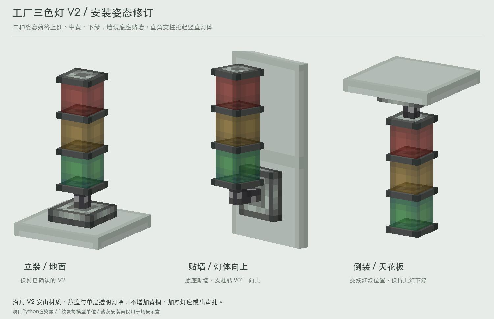

# V2 安装姿态：按用户纠正的第二版

用户明确要求：**“倒装的时候颜色反过来，上墙的时候底座贴墙然后转90度让灯体竖直向上”**。

本目录已替换上一轮错误的“墙装水平伸出、倒装上绿下红”方案。立式V2基准不变；本页为根据用户要求制作的修订预览，尚未接入游戏。

## 三种姿态

- 立装：原V2，安装脚贴地面，灯体向上。
- 贴墙：8×8安山安装脚贴墙，工业铁支柱形成90°直角，灯体保持竖直向上。灯罩、隔片及顶盖保持V2原尺寸和材质。
- 倒装：安装脚贴天花板，灯体向下悬挂，同时交换红绿灯位置。**按世界竖直方向，三种姿态均从上到下红、黄、绿。**

颜色位置和点亮状态需分别处理：倒装后绿灯位于最下方，绿色状态必须点亮该位置，不能只交换关闭贴图或把绿色信号接到上方红灯。黄色保持中间。

图中浅灰安装面只用于说明贴附关系，不属于灯体、模型或碰撞。

## 文件与复现

- `mounting-views.png`：修订后三种姿态总览。
- `floor.png`、`wall_north.png`、`ceiling.png`：单独视图。
- `wall-side.png`：墙装正侧视，方便查看直角支柱。
- `mounting-green-on.png`：三种姿态最下方绿灯点亮的对照。
- `transforms.json`：修订号2，地面、天花板及四个墙向的构造规则、安装面和包围盒。
- `preview-mesh-*.json`：六个方向的实际关闭态渲染网格，保留部件名称、顶点、纹理和UV；属于离线面网格，**不是Minecraft方块JSON**。

运行交接包的`renderer/render_mountings.py`即可自包含复现，无需Create jar。使用项目Python渲染器快照，无图像生成模型。

## 具体构造

### 朝北墙装基准

朝北是指墙面位于z=16，支架向负Z伸出，灯体沿正Y竖直向上。

| 部件 | from | to | 构造 |
|---|---|---|---|
| 安山安装脚 | 4,4,14 | 12,12,16 | V2安装脚绕[8,8,8]的X轴-90° |
| 水平铁支柱 | 7,7,11 | 9,9,14 | V2支柱同样旋转 |
| 竖直铁支柱 | 7,7,9 | 9,10,11 | 原支柱复制后平移[0,5,2] |
| 完整灯组 | 5,10,7 | 11,29,13 | 原V2四片隔盖和三颗灯罩整体平移[0,5,2] |

水平和竖直支柱相接，形成简短直角。只有墙装新增这一段同材质、同截面的支柱，不改原灯组的比例、UV或像素密度。

整体包围盒为`[4,4,7]`到`[12,29,16]`。竖向总跨度25单位；从墙面到最前端9单位。安装脚仍8×8×2，支柱截面2×2。其余三个墙向以此模型绕[8,8,8]的Y轴旋转，具体角度见`transforms.json`。

### 倒装

原V2整灯绕[8,8,8]的X轴旋转180°，同时交换红绿灯的**逻辑颜色身份**并选取对应点亮状态贴图。安装面y=16，包围盒`[4,-8,4]`到`[12,16,12]`，长度仍24单位。旋转后顶部红灯、中央黄灯、底部绿灯。

## 接入与验证

上述角度使用Python右手系世界坐标，**不是已验证的blockstate x/y数值**。墙装由分部件旋转和平移构成，不能对原V2整灯简单旋转90°代替。倒装同样需正确绑定颜色和对应业务信号。

脚本检查5个灯光样例×6个安装方向共30组：世界高度红>黄>绿、点亮材质与逻辑颜色一致、灯罩保持5×5×5、全表面1纹素/模型单位、包围盒正确。立装/倒装9部件54面，墙装10部件60面。

程序侧仍需处理邻接空间、安装面、碰撞/选取范围、放置/拆除和引擎纹理旋转。墙装最高到y=29，倒装最低到y=-8，不能仅改变显示而忽略超出单格的部分。灯光业务与发声逻辑由相应程序任务定义。
